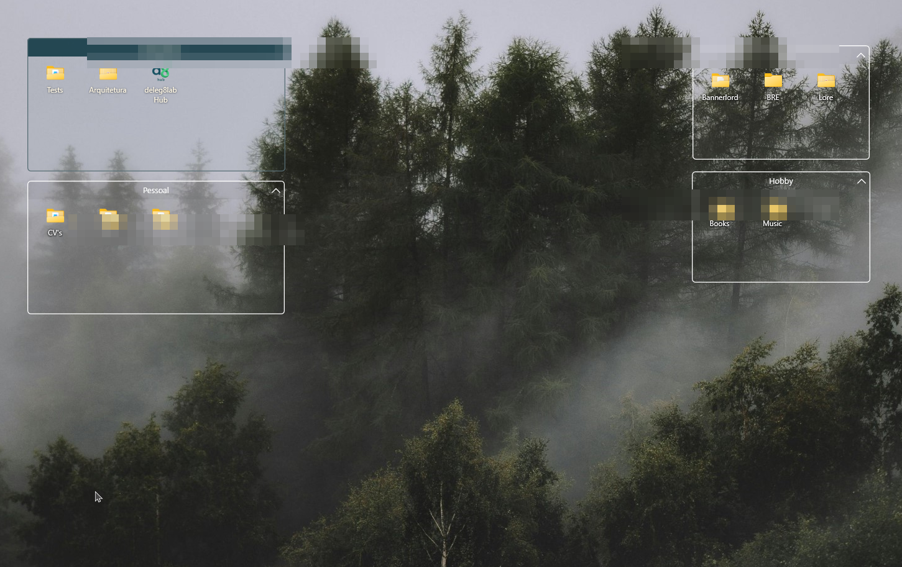
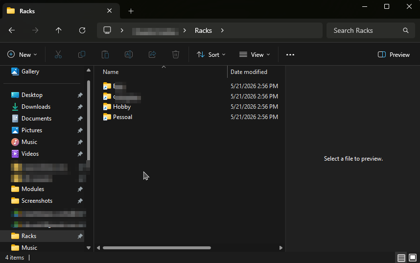

# Racks

### Your desktop, finally organized.

**A fast, lightweight desktop organizer for Windows 10/11.**
Floating racks that group your files. Tray-resident. Doesn't touch the originals.

  
  &nbsp;
  
  &nbsp;
  
  &nbsp;
  

If Racks saves your desktop, consider <a href="https://github.com/duartelcunha/Racks">⭐ starring the repo</a> — it genuinely helps.

---

  

## The desktop tax

You know the cycle. Files pile up on the desktop "just for a minute." A minute becomes a month. You spend ten seconds finding `report-final-v3.docx` every time, and tidying means a 20-minute archaeology session you keep postponing.

Racks fixes this without asking you to change a single habit. You still drag files onto your desktop — they just land in the right place automatically.

  
   
  <i>Drag → drop → done. Your desktop stays empty, your files stay yours.</i>

## Why people keep it installed

- 🎯 **Drop-and-forget.** Drag anything onto a rack — file, folder, browser tab, shortcut. It lands in a clean sandbox in AppData. Your Desktop wallpaper is visible again.
- 🔍 **Quick Finder.** `Ctrl+Shift+Space` opens a Spotlight-style search across every rack. Type, `Enter`, you're in the file.
- 🤖 **Auto-route by regex.** Set a pattern per rack (`\.pdf$`, `^Invoice-`, whatever) — matching files dropped on the Desktop are routed instantly. Screenshots into "Screenshots," invoices into "Finance," and you never lift a finger.
- 📂 **Lives in every file picker.** Racks are pinned to Explorer Quick Access on first launch. Upload from a browser? Click "Racks" in the sidebar, click the rack, done.
- 🎨 **Make it yours.** Seven theme presets plus full hex/regex/opacity controls. Round corners, custom fonts, per-rack icon sizes, animation speed, grayscale-when-inactive — all of it.
- 🛡️ **Safe by design.** Removing a rack only ever deletes its own sandbox. Point a rack at `Documents` and remove it — `Documents` is exactly as you left it.
- 💨 **It gets out of the way.** Double-click the wallpaper to hide every rack instantly. Hot corner brings them back.
- ✈️ **Round-trip your layout.** One JSON file exports every rack, every theme, every setting. Restore on a new machine in one click.

## See it in action

<table>
  <tr>
    <td width="50%" align="center">
      
       
      <b>Phone-style reorder.</b> Drag tiles inside a rack. Smooth animation, no flicker.
    </td>
    <td width="50%" align="center">
      
       
      <b>Collapse to the title bar.</b> Tuck a rack out of the way without losing it.
    </td>
  </tr>
  <tr>
    <td width="50%" align="center">
      
       
      <b>Customize every pixel.</b> Colors, fonts, regex filters, opacity, snap, lock.
    </td>
    <td width="50%" align="center">
      
       
      <b>Quick Access integration.</b> Every rack reachable from any file picker.
    </td>
  </tr>
</table>

## Install

### [⬇️ Download the latest release](https://github.com/duartelcunha/Racks/releases/latest)

Double-click `Racks-Setup-x.y.z.exe`. Installs per-user under `%LocalAppData%\Programs\Racks` — **no admin prompt, no choices, ~5 seconds**. Racks starts in the system tray; right-click the tray icon to create your first rack.

> **Prefer portable?** Grab the `Racks-portable-x.y.z.zip` from the same release page and run `Racks.exe` directly. Settings live in the registry under `HKCU\SOFTWARE\Racks`.

## Shortcuts

| Shortcut | Action |
| --- | --- |
| `Ctrl+Shift+N` | New empty rack |
| `Ctrl+Shift+Space` | Quick Finder (cross-rack search) |
| `Ctrl`-drop | Link on this drop (keep original on Desktop) |
| `Shift`-drop | Move on this drop (override Link-on-drop toggle) |
| `Shift`-drag from rack | Drag an item *out* of the rack into another app |
| `Alt`+drag rack | Bypass snap-to-grid |
| `Ctrl`+scroll inside rack | Resize icons |
| Double-click wallpaper | Hide / show all racks |

Right-click the tray icon for the global menu (new rack, hide desktop, import/export layout, settings). Right-click any rack's title bar for per-rack options.

## FAQ

**Does Racks move my files around behind my back?**
No. A default drop *moves* the file from the Desktop into the rack's sandbox (so the Desktop stays clean). Hold `Ctrl` to keep the original where it was. Removing a rack only ever deletes its own sandbox in AppData — never a real folder you pointed it at.

**Will it slow my PC down?**
Idle CPU is ~0%. Memory sits around 60–90 MB. There's no background indexer.

**Does it phone home?**
No telemetry, no analytics, no auto-updates pinging a server. It's a single `.exe` that talks to the Windows shell and the registry, full stop.

**What if Explorer crashes / I unplug a monitor?**
Racks listens for `WM_DISPLAYCHANGE` and the Explorer `TaskbarCreated` message and recovers automatically. Racks on a disconnected monitor snap back to the primary instead of being stranded off-screen.

## Star the repo ⭐

If Racks earns a spot on your machine, **[give it a star](https://github.com/duartelcunha/Racks)**. Stars are how this project gets discovered by other people drowning in desktop clutter — and they're the only feedback signal I have that the work is worth continuing.

## License

Racks is proprietary software. © 2026 Duarte L. Cunha. All rights reserved.
Free to install and use; redistribution, modification, and reverse engineering are not permitted. See [`LICENSE.txt`](LICENSE.txt).

Third-party components and required upstream attributions are listed in [`THIRD-PARTY-NOTICES.md`](THIRD-PARTY-NOTICES.md).
