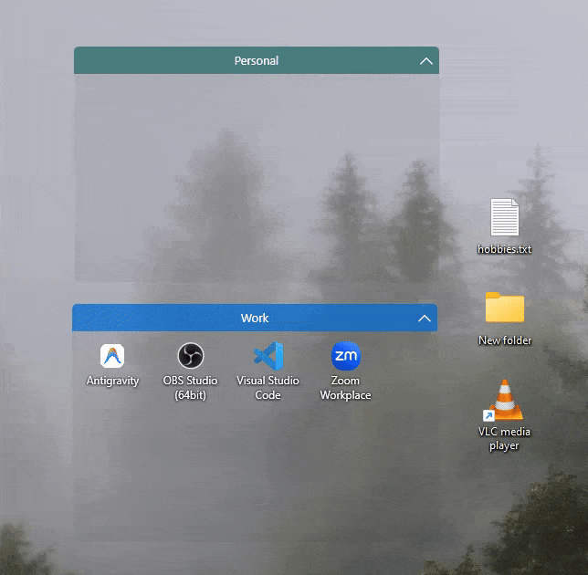
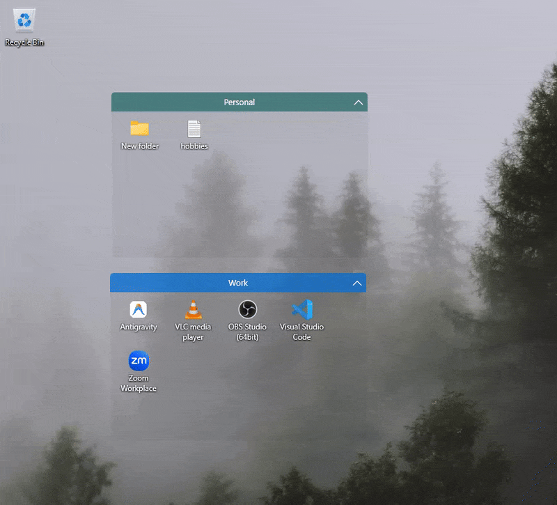
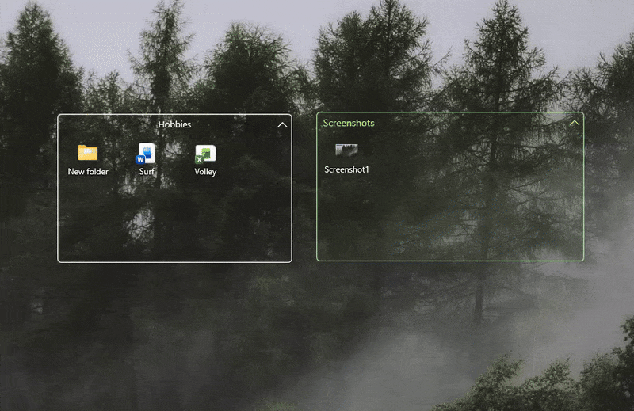

# Racks

**A floating desktop organizer for Windows.**

Tray-resident. Drop files into racks instead of onto your desktop. Zero clutter.

  
  &nbsp;
  
  &nbsp;
  
  &nbsp;
  

 

<i>Keep your wallpaper clean. Drag files in, and they live one click away in a safe sandbox.</i>

---

## Why Racks?

Your desktop shouldn't be a dumping ground. Racks lives quietly in your system tray and lets you create floating spaces on your wallpaper. Drag files in, and they're moved to a clean, safe folder. No cloud, no background indexers, no telemetry. Just a fast, native Windows tool that respects your resources.

 

## Drag in. Done.

Whatever you drop into a rack (files, folders, browser tabs, shortcuts) is instantly moved to an AppData sandbox. Your desktop stays spotless.

- Default drag: **Moves** the file.
- `Ctrl` + drag: **Copies** the file (keeps original).
- `Shift` + drag out: Pulls the item back out to another app.

 

## Built for you

  

Create as many racks as you need. Every single one is completely independent. Dial in your own colors, fonts, opacities, and icon sizes, or set up regex rules to auto-sort files exactly where they belong.

 

## Blend into your wallpaper

  

Don't like heavy UI? Racks can be styled to look like pure glass. Strip away the backgrounds, keep just the borders, and let your wallpaper shine through. Need more space? Click the chevron to collapse any rack into a tiny title bar.

 

## Settings that make sense

The settings panel snaps right next to the rack you're tweaking and updates **live**. No "Apply" buttons.
- Real-time color pickers with hex validation.
- Live font previews showing all your installed typefaces.
- One-click style copying between racks.

 

## Everything else

- 🔍 **Quick Finder:** Hit `Ctrl+Shift+Space` to search across all your racks instantly.
- 🪄 **Magic Organizer:** One click scans your desktop and builds a perfect, staggered grid of categorized racks.
- 💥 **Physics Engine:** Racks act like solid objects. Drag one into another and watch them smoothly push each other out of the way.
- 🎬 **Premium Polish:** Fluid 60fps animations, from the signature startup sequence to bouncy file drops.
- 🤖 **Auto-Routing:** Drop an invoice on the desktop, and if your regex matches, it flies straight into your "Finance" rack.
- 🖥️ **Multi-Monitor Smart:** Unplug a screen? Racks gracefully snap back to your primary display.
- ✈️ **Portable Layouts:** Export every single rack, theme, and setting to a single JSON file. Restore on a new PC in one click.

 

## Get it running

### [⬇️ Download v1.1.1](https://github.com/duartelcunha/Racks/releases/latest)

Download `Racks-Installation.zip`, extract, and run `Racks.exe`. No admin prompts, no installers. Racks boots into your tray in seconds. Right-click the icon to start.

 

## Cheatsheet

| Shortcut | Action |
| --- | --- |
| `Ctrl+Shift+N` | New rack |
| `Ctrl+Shift+Space` | Quick Finder |
| `Ctrl`-drop | Keep original on Desktop |
| `Alt`+drag | Bypass grid snapping |
| `Ctrl`+scroll | Resize icons |
| Double-click wallpaper | Hide / show all racks |

 

## Star the repo ⭐

If Racks cleans up your workflow, **[drop a star](https://github.com/duartelcunha/Racks)**. It's the best way to help others find the tool and lets me know the late nights were worth it.

 

## License

Proprietary software. © 2026 Duarte L. Cunha. Free to use, but modification, redistribution, or reverse engineering are not allowed. See [`LICENSE.txt`](LICENSE.txt) and [`THIRD-PARTY-NOTICES.md`](THIRD-PARTY-NOTICES.md).
