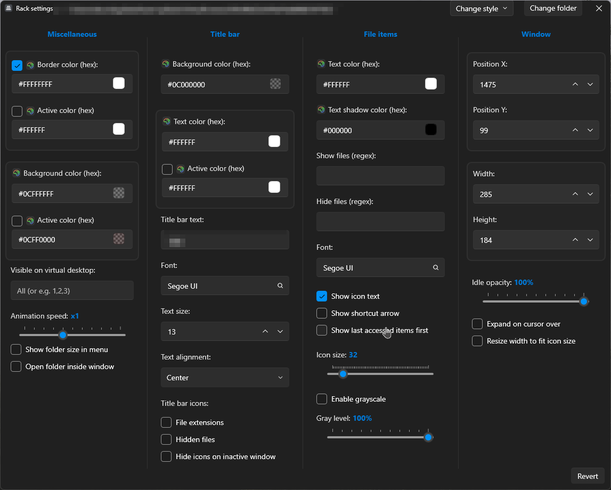

# Racks

### A floating desktop organizer for Windows.

Tray-resident. Drop files into racks instead of onto your desktop. Doesn't touch the originals.

  
  &nbsp;
  
  &nbsp;
  
  &nbsp;
  

 

---

## What it does

Racks lives in your system tray. Click **New rack** and a floating window appears on your wallpaper. Drag files into it and they're moved into a clean sandbox, one click away. Pin it, theme it, regex-route to it, search across every rack with a hotkey.

That's it. No cloud, no telemetry, no background indexer.

 

## Drag in. Done.

Anything you drop on a rack (file, folder, browser tab, app shortcut) lands in a clean sandbox in AppData. Your desktop stays empty without you ever opening a file manager.

Hold `Ctrl` to keep the original where it was. Hold `Shift` to drag a tile *out* of the rack into any other app. That's the entire mental model.

 

## Reorder like a phone

  

Drag tiles inside a rack to reorder them. Smooth animation, no flicker, no save button. The order sticks across restarts.

 

## Collapse it out of the way

  

Click the chevron and a rack folds into its title bar, taking up almost no space but still one click away. Double-click empty wallpaper to hide every rack at once.

 

## Customize every pixel

  

Per-rack settings for colors (hex picker, with active/inactive states), fonts, icon size, opacity, snap-to-grid, lock, animation speed, regex filters for what to show or hide, and seven one-click theme presets. Set defaults globally; override anything per rack.

 

## Also in the box

- 🔍 **Quick Finder.** `Ctrl+Shift+Space` opens a Spotlight-style search across every rack. Type, `Enter`, you're in the file.
- 🤖 **Auto-route by regex.** Per-rack patterns (`\.pdf$`, `^Invoice-`, anything). Matching files dropped on the Desktop are moved in automatically. Screenshots into "Screenshots," invoices into "Finance."
- 📂 **Lives in every file picker.** Racks are pinned to Explorer Quick Access on first launch. Uploading from a browser? Click "Racks" in the sidebar, click the rack, done.
- 🛡️ **Safe by design.** Removing a rack only ever deletes its own sandbox. Point a rack at `Documents` and remove it, and `Documents` is exactly as you left it.
- 🖥️ **Multi-monitor aware.** Unplug a screen and racks snap back to the primary instead of being stranded off-screen.
- ✈️ **Round-trip your layout.** One JSON file exports every rack, every theme, every setting. Restore on a new machine in one click.

 

## Install

### [⬇️ Download the latest release](https://github.com/duartelcunha/Racks/releases/latest)

Double-click `Racks-Setup-x.y.z.exe`. Installs per-user under `%LocalAppData%\Programs\Racks`. **No admin prompt, no choices, ~5 seconds.** Racks starts in the system tray; right-click the tray icon to create your first rack.

> **Prefer portable?** Grab the `Racks-portable-x.y.z.zip` from the same release page and run `Racks.exe` directly. Settings live in the registry under `HKCU\SOFTWARE\Racks`.

 

## Shortcuts

| Shortcut | Action |
| --- | --- |
| `Ctrl+Shift+N` | New empty rack |
| `Ctrl+Shift+Space` | Quick Finder (cross-rack search) |
| `Ctrl`-drop | Link on this drop (keep original on Desktop) |
| `Shift`-drop | Move on this drop (override Link-on-drop toggle) |
| `Shift`-drag from rack | Drag an item *out* of the rack into another app |
| `Alt`+drag rack | Bypass snap-to-grid |
| `Ctrl`+scroll inside rack | Resize icons |
| Double-click wallpaper | Hide / show all racks |

Right-click the tray icon for the global menu (new rack, hide desktop, import/export layout, settings). Right-click any rack's title bar for per-rack options.

 

## FAQ

**Does Racks move my files around behind my back?**
No. A default drop *moves* the file from the Desktop into the rack's sandbox (so the Desktop stays clean). Hold `Ctrl` to keep the original where it was. Removing a rack only ever deletes its own sandbox, never a real folder you pointed it at.

**Will it slow my PC down?**
Idle CPU is ~0%. Memory sits around 60 to 90 MB. No background indexer.

**Does it phone home?**
No telemetry, no analytics, no auto-update pings. A single `.exe` talking to the Windows shell and the registry.

**What if Explorer crashes or I unplug a monitor?**
Racks listens for `WM_DISPLAYCHANGE` and the Explorer `TaskbarCreated` message and recovers automatically. Racks on a disconnected monitor snap back to the primary instead of being stranded.

 

## Star the repo ⭐

If Racks earns a spot on your machine, **[give it a star](https://github.com/duartelcunha/Racks)**. Stars are how this project gets discovered by other people drowning in desktop clutter, and the only feedback signal that tells me the work is worth continuing.

 

## License

Racks is proprietary software. © 2026 Duarte L. Cunha. All rights reserved.
Free to install and use; redistribution, modification, and reverse engineering are not permitted. See [`LICENSE.txt`](LICENSE.txt).

Third-party components and required upstream attributions are listed in [`THIRD-PARTY-NOTICES.md`](THIRD-PARTY-NOTICES.md).
